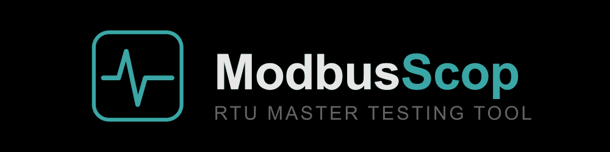

<p align="center">
  
</p>

**ModbusScop** is a free **Modbus master and testing tool** with a modern, dockable
**Dear ImGui** interface. It talks to real devices over **Modbus TCP** and
**Modbus RTU (serial)**, and is built for engineers who need to poll, inspect,
write, and troubleshoot Modbus devices quickly.

Free to use and redistribute under the permissive **BSD 2-Clause License**.

Developed by **Carlos Nardi**.

[](https://buymeacoffee.com/cnardi)

<p align="center">
  
</p>

## Features

- **Dockable poll windows** — one per request, each with its own slave ID,
  function code, address, quantity, and scan rate. Arrange and dock them however
  you like.
- **Rich data display** — per-cell formats (Signed / Unsigned / Hex / Binary,
  plus 32- and 64-bit integers, floats, and doubles with selectable byte order),
  Base-1 register addressing, and a per-bit editor.
- **Reading & writing** — function codes 01–06, 15, 16, plus **Mask Write
  Register (FC 22)** and **Read/Write Multiple Registers (FC 23)**. Write single
  cells straight from a read window with a double-click command popup.
- **Tools** — **Inspect** (send any single message and decode the reply, with a
  live FC 22 mask preview), **Device Scan** (sweep slave IDs to find who's on the
  bus), and **Register Scan** (sweep an address range on one device). Results
  export to CSV.
- **Diagnostics** — a timestamped communication monitor with file logging and
  rotation, a human-readable status log, and a dashboard with live traffic
  counters and uptime.
- **Workspaces** — save and reload your entire setup: connection settings, every
  window, cell aliases, formats, and values.
- **Themes** — dark / light / classic with a customizable accent color; layout
  and preferences are remembered between runs.

## Download & run

1. Go to the [**Releases**](../../releases) page and download the latest
   `ModbusScopMaster` archive for Windows.
2. Unzip it anywhere and run **`ModbusScopMaster.exe`** — no installation required.

**Requirements:** Windows 10/11 (64-bit).

### Connecting

- **Modbus TCP** — enter the device IP and port (default 502), then **Connect**.
- **Modbus RTU** — pick the serial port and set baud rate, data bits, parity, and
  stop bits, then **Connect**.

Use **Quick Connect** (Connection menu or the toolbar button) to connect with the
current settings without opening the dialog.

## Third-party libraries

ModbusScop is built with these open-source components, each under its own license:

| Library | Used for | License |
|---------|----------|---------|
| Dear ImGui (docking) | user interface | MIT |
| GLFW 3 | window / OpenGL context | Zlib/libpng |
| OpenGL 3 | rendering | — |
| ZeroMQ (libzmq) | Modbus TCP | MPL 2.0 |
| Asio (standalone) | Modbus RTU (serial) | Boost Software License 1.0 |
| stb_image | logo / splash decoding | MIT / public domain |

## License

ModbusScop is released under the **BSD 2-Clause License**. It is provided "as is",
without warranty of any kind; the author is not responsible for any damage or loss
caused by its use.

```
BSD 2-Clause License

Copyright (c) 2026, Carlos Nardi
All rights reserved.

Redistribution and use in source and binary forms, with or without
modification, are permitted provided that the following conditions are met:

1. Redistributions of source code must retain the above copyright notice,
   this list of conditions and the following disclaimer.

2. Redistributions in binary form must reproduce the above copyright notice,
   this list of conditions and the following disclaimer in the documentation
   and/or other materials provided with the distribution.

THIS SOFTWARE IS PROVIDED BY THE COPYRIGHT HOLDERS AND CONTRIBUTORS "AS IS"
AND ANY EXPRESS OR IMPLIED WARRANTIES, INCLUDING, BUT NOT LIMITED TO, THE
IMPLIED WARRANTIES OF MERCHANTABILITY AND FITNESS FOR A PARTICULAR PURPOSE
ARE DISCLAIMED. IN NO EVENT SHALL THE COPYRIGHT HOLDER OR CONTRIBUTORS BE
LIABLE FOR ANY DIRECT, INDIRECT, INCIDENTAL, SPECIAL, EXEMPLARY, OR
CONSEQUENTIAL DAMAGES (INCLUDING, BUT NOT LIMITED TO, PROCUREMENT OF
SUBSTITUTE GOODS OR SERVICES; LOSS OF USE, DATA, OR PROFITS; OR BUSINESS
INTERRUPTION) HOWEVER CAUSED AND ON ANY THEORY OF LIABILITY, WHETHER IN
CONTRACT, STRICT LIABILITY, OR TORT (INCLUDING NEGLIGENCE OR OTHERWISE)
ARISING IN ANY WAY OUT OF THE USE OF THIS SOFTWARE, EVEN IF ADVISED OF THE
POSSIBILITY OF SUCH DAMAGE.
```
