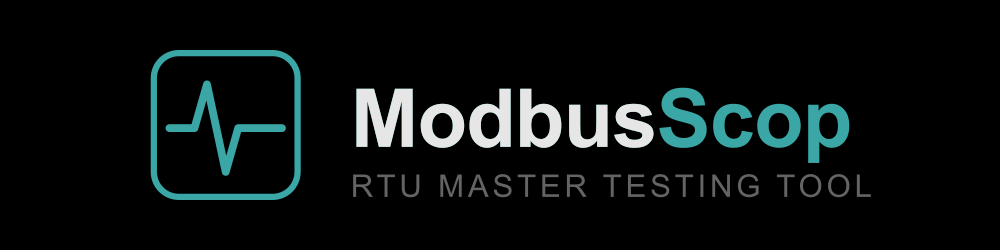

<p align="center">
  
</p>

**ModbusScop Master** is a free **Modbus master / polling and testing tool** with
a modern, dockable **Dear ImGui** interface. It talks to real devices over
**Modbus TCP**, **Modbus UDP**, and **Modbus RTU (serial)** — and can also send
**RTU-framed requests over TCP/UDP** for terminal servers that bridge a network
link to a serial RTU bus. It is built for engineers who need to poll, inspect,
write, and troubleshoot many Modbus devices at once.

Free to use and redistribute under the permissive **BSD 2-Clause License**.

Developed by **Carlos Nardi**.

[](https://buymeacoffee.com/cnardi)

<p align="center">
  
</p>

## Concept

ModbusScop Master is organized as a tree: **Channels → RTUs → Maps**.

- A **Channel** is one connection. It is either a **Network** channel (TCP or
  UDP, with a per-channel **framing** choice — standard *Modbus TCP (MBAP)* or
  *Modbus RTU (slave id + PDU + CRC, no MBAP)*) or a **Serial** channel (a Modbus
  RTU bus on a COM port). Each channel runs on its own I/O thread; start and stop
  them independently.
- An **RTU** is one unit id behind a channel. A channel can host many RTUs, and
  because this is a master, several RTUs may even share the same unit id. Each RTU
  has an editable name and unit id.
- A **Map** is a poll definition under an RTU — the familiar poll window with its
  function code, address, quantity, and scan rate. **Double-click a map** to open
  its window. While a channel is **Started**, every map under it polls in the
  background at its own rate, so you can interface many devices simultaneously.

## Features

- **Multi-device polling** — many channels, each with many RTUs and maps, all
  polling concurrently. Network channels (MBAP framing) pipeline several requests
  in flight; serial and RTU-over-network channels are half-duplex, one
  transaction at a time.
- **TCP, UDP, and Serial** — connect over Modbus TCP, Modbus UDP, or Modbus RTU
  on a serial port, chosen per channel in the New Channel dialog (**Network /
  Serial**, and for Network **TCP / UDP**).
- **Modbus RTU over the network** — a per-channel framing selector lets a TCP or
  UDP channel carry RTU-style frames (slave id + PDU + CRC16, no MBAP header),
  the way terminal servers expose serial RTU devices over Ethernet.
- **Dockable poll windows** — one per map, each with its own function code,
  address, quantity, and scan rate; the unit id comes from the parent RTU. Arrange
  and dock them however you like.
- **Rich data display** — per-cell formats (Signed / Unsigned / Hex / Binary,
  plus 32- and 64-bit integers, floats, and doubles with selectable byte order),
  Base-1 register addressing, per-cell aliases, and a per-bit editor.
- **New-value animation** — poll cells flash when a freshly received value differs
  from the one they held. The tint, fade speed, and on/off are configurable under
  **View → Animation Colors**.
- **Reading & writing** — function codes 01–06, 15, 16, plus **Mask Write
  Register (FC 22)** and **Read/Write Multiple Registers (FC 23)**. Write single
  cells straight from a read window with a double-click command popup.
- **Tools** — **Inspect** (send any single message and decode the reply, with a
  live FC 22 mask preview), **Device Scan** (sweep unit ids to find who's on the
  bus), and **Register Scan** (sweep an address range on one device). Point the
  tools at any channel from the channel's context menu or the Tools menu; results
  export to CSV.
- **Diagnostics** — a timestamped communication monitor with file logging and
  rotation, a human-readable status log, and a dashboard with live traffic
  counters and uptime.
- **Workspaces** — save and reload your entire setup: channels (including
  transport and framing), RTUs, every map, cell aliases, formats, and values.
  Individual maps can also be exported and imported on their own.
- **Themes** — dark / light / classic with a customizable accent color; layout
  and preferences are remembered between runs.

## Download & run

1. Go to the [**Releases**](../../releases) page and download the latest
   `ModbusScopMaster` archive for Windows.
2. Unzip it anywhere and run **`ModbusScopMaster.exe`** — no installation
   required.

**Requirements:** Windows 10/11 (64-bit).

**Rendering:** ModbusScop Master uses the GPU by default; you can switch to **CPU
(software)** rendering under **View → Rendering** (handy over Remote Desktop or in
VMs).

### Getting started

1. **+ Network** or **+ Serial** — create a channel.
   - **Network** — choose **TCP** or **UDP**, the **Framing** (*Modbus TCP
     (MBAP)* or *Modbus RTU over the network*), the host/IP and port, and (for
     MBAP) the max parallel requests.
   - **Serial** — pick the COM port and set baud rate, data bits, parity, and stop
     bits.
   Each new channel starts with one RTU (unit id 1); add more with **Add RTU**.
2. **+ Map** on an RTU — add a poll definition, then **double-click** it to open
   the poll window and set the function code, address, quantity, and scan rate.
3. Press **Start** on the channel. Every map under it begins polling; watch the
   traffic in the **Communication Monitor** and the counters in the **Dashboard**.

Use **File → Save Workspace** (Ctrl+S) to keep the whole configuration and reload
it later with **Open Workspace** (Ctrl+O).

## Third-party libraries

ModbusScop Master is built with these open-source components, each under its own
license:

| Library | Used for | License |
|---------|----------|---------|
| Dear ImGui (docking) | user interface | MIT |
| GLFW 3 | window / OpenGL context | Zlib/libpng |
| OpenGL 3 | rendering | — |
| Asio (standalone) | Modbus TCP / UDP / RTU transport | Boost Software License 1.0 |
| stb_image | logo / splash decoding | MIT / public domain |


## License

ModbusScop Master is released under the **BSD 2-Clause License**. It is provided
"as is", without warranty of any kind; the author is not responsible for any
damage or loss caused by its use.

```
BSD 2-Clause License

Copyright (c) 2026, Carlos Nardi
All rights reserved.

Redistribution and use in source and binary forms, with or without
modification, are permitted provided that the following conditions are met:

1. Redistributions of source code must retain the above copyright notice,
   this list of conditions and the following disclaimer.

2. Redistributions in binary form must reproduce the above copyright notice,
   this list of conditions and the following disclaimer in the documentation
   and/or other materials provided with the distribution.

THIS SOFTWARE IS PROVIDED BY THE COPYRIGHT HOLDERS AND CONTRIBUTORS "AS IS"
AND ANY EXPRESS OR IMPLIED WARRANTIES, INCLUDING, BUT NOT LIMITED TO, THE
IMPLIED WARRANTIES OF MERCHANTABILITY AND FITNESS FOR A PARTICULAR PURPOSE
ARE DISCLAIMED. IN NO EVENT SHALL THE COPYRIGHT HOLDER OR CONTRIBUTORS BE
LIABLE FOR ANY DIRECT, INDIRECT, INCIDENTAL, SPECIAL, EXEMPLARY, OR
CONSEQUENTIAL DAMAGES (INCLUDING, BUT NOT LIMITED TO, PROCUREMENT OF
SUBSTITUTE GOODS OR SERVICES; LOSS OF USE, DATA, OR PROFITS; OR BUSINESS
INTERRUPTION) HOWEVER CAUSED AND ON ANY THEORY OF LIABILITY, WHETHER IN
CONTRACT, STRICT LIABILITY, OR TORT (INCLUDING NEGLIGENCE OR OTHERWISE)
ARISING IN ANY WAY OUT OF THE USE OF THIS SOFTWARE, EVEN IF ADVISED OF THE
POSSIBILITY OF SUCH DAMAGE.
```
